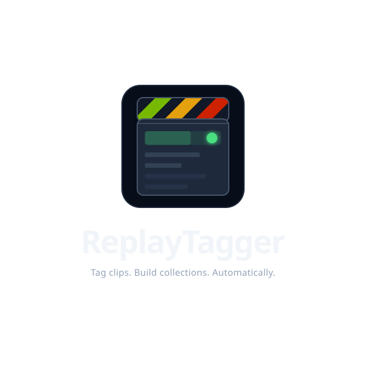
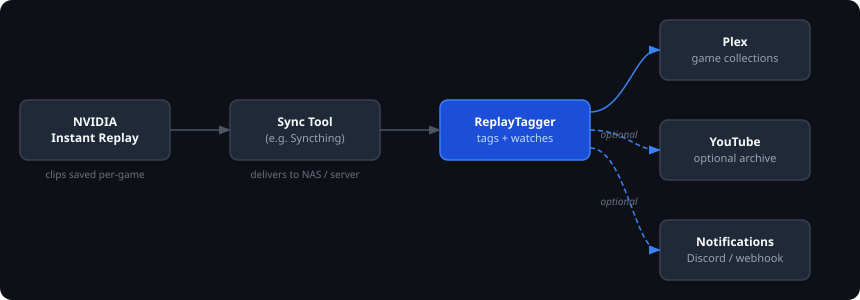
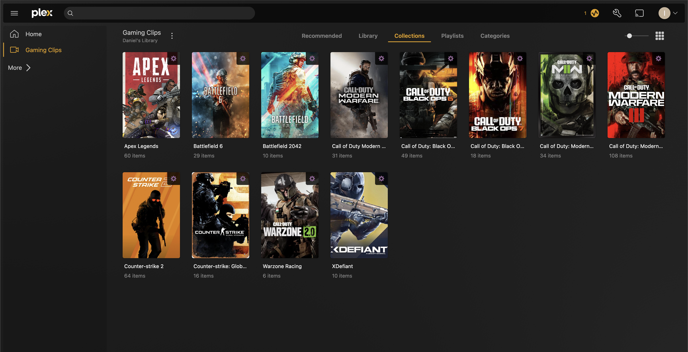

<p align="center">
  
</p>

Watches your game clips folder and tags each file with its game name so Plex builds per-game collections automatically. Works with NVIDIA Instant Replay, OBS, AMD ReLive, or any capture tool that organizes clips into per-game folders.

[](https://github.com/iamclements/replay-tagger/actions/workflows/ci.yml)
[](https://github.com/iamclements/replay-tagger/actions/workflows/security.yml)
[](LICENSE)
[](https://github.com/iamclements/replay-tagger/pkgs/container/replay-tagger)

---

## The idea

NVIDIA saves clips into folders named after the game you were playing, whether triggered by a hotkey or recorded as a full session. ReplayTagger watches those folders and writes the game name into each clip's genre metadata using ffmpeg. Plex reads that tag and automatically places each clip into the right game collection.

Other capture software that organizes clips into per-game subfolders works the same way; the folder name is all ReplayTagger needs.

**Your video files are not re-encoded.** ffmpeg remuxes to a temp file in the same directory, atomically replaces the original, and restores the original modification timestamp. The file is identical except for the genre tag.

YouTube archiving is an optional bonus. Clips are uploaded as-is; YouTube re-encodes everything through their own pipeline regardless, so there's no benefit to pre-encoding locally. Each file is fingerprinted so it's never uploaded twice even if you rename it.

---

## What you need

- **A gaming PC** with [NVIDIA GeForce Experience](https://www.nvidia.com/en-us/geforce/geforce-experience/) or any capture tool that saves clips into per-game subfolders
- **A homelab server or NAS** running Docker (this is where ReplayTagger and Plex live: Synology, Unraid, TrueNAS SCALE, Raspberry Pi, or any Linux machine)
- **Plex Media Server** already running on that server
- **A way to get clips to your server**: [Syncthing](https://syncthing.net/) is the easiest option (see [Step 2](#step-2-get-your-clips-to-the-server))

> **ReplayTagger runs on your server, not your gaming PC.** It only needs network access to Plex and to the folder where clips land; it doesn't have to run on the same host as Plex.

Optional: a Google account for YouTube archiving.

---

> **Already have Plex and Docker running?** Skip the tutorial:
> ```bash
> curl -O https://raw.githubusercontent.com/iamclements/replay-tagger/main/docker-compose.yml
> curl -O https://raw.githubusercontent.com/iamclements/replay-tagger/main/.env.example && mv .env.example .env
> # Edit .env: set CLIPS_DIR, PLEX_URL, PLEX_TOKEN, PLEX_LIBRARY_NAME
> docker compose up -d && docker compose run --rm replaytagger doctor
> ```

---

## How it works

Your capture software organizes clips into per-game folders (NVIDIA GeForce Experience does this automatically):

```
Videos/
├── Apex Legends/
│   ├── clip1.mp4   ← tagged "Apex Legends"
│   └── clip2.mp4
└── Cyberpunk 2077/
    └── clip1.mp4   ← tagged "Cyberpunk 2077"
```



1. A clip is saved to a per-game folder on your gaming PC
2. A sync tool (e.g. Syncthing) delivers it to your server
3. ReplayTagger detects the new file and writes the game name into the genre tag
4. Plex reads the tag and adds the clip to the matching game collection
5. Optionally: a webhook notification fires and a YouTube upload is queued

---

## Setup

### Step 0: Get docker-compose.yml

Download [docker-compose.yml](docker-compose.yml) to the machine that will run the container. The image is pulled automatically on first start; nothing else needs to be installed.

```bash
curl -O https://raw.githubusercontent.com/iamclements/replay-tagger/main/docker-compose.yml
```

NAS and GUI users (Synology, Unraid, Portainer): download the file and skip to [NAS / Container Management UIs](#nas--container-management-uis).

---

### Step 1: Create a Plex library

1. Plex Web → **Libraries** → **Add Library**
2. Type: **Movies** (Home Videos doesn't support genre-based collections)
3. Name it (e.g. `Gaming Clips`) and note the exact name
4. Point it at the folder where clips will land
5. **Advanced** tab → **"Automatically create collections"** → **"by Genre"**

Note the library name; it goes into `PLEX_LIBRARY_NAME` in `.env` in Step 3.

> **Tip:** if Plex is matching your clips against its movie database and overwriting the genre tag, go to the library's **Advanced** settings and switch the agent to **Personal Media**. ReplayTagger writes genre tags directly into the file (no online matching needed).

> **If `PLEX_LIBRARY_NAME` doesn't match exactly, ReplayTagger will exit at startup with a `plex_library_not_found` error.** Run `docker compose run --rm replaytagger doctor` to verify connectivity and confirm the library name before starting the watcher.

---

### Step 2: Get your clips to the server

**Where NVIDIA saves clips**

By default, NVIDIA GeForce Experience saves to:
```
C:\Users\<your-username>\Videos\
```
Each game gets its own subfolder automatically.

**Syncing to your server**

[Syncthing](https://syncthing.net/) is the recommended option: free, open source, and runs on Windows, Linux, and most NAS platforms. See the [Getting Started guide](https://docs.syncthing.net/intro/getting-started.html) for setup.

Alternatives:
- **Network share (SMB):** Map your server's clips folder as a network drive on your gaming PC, then change the NVIDIA save path in GeForce Experience → **Settings** → **General** → video save location. No sync tool needed.
- **Same machine:** If you run Docker on your gaming PC, point `CLIPS_DIR` at your NVIDIA clips folder directly

---

### Step 3: Configure

Download [.env.example](.env.example) as `.env` next to your `docker-compose.yml`:

```bash
curl -O https://raw.githubusercontent.com/iamclements/replay-tagger/main/.env.example
mv .env.example .env
```

Edit `.env` and set at minimum:

```bash
CLIPS_DIR=/path/to/your/clips  # host-side path; /clips inside the container
PLEX_URL=http://192.168.1.100:32400
PLEX_ENABLED=true
PLEX_LIBRARY_NAME=Gaming Clips  # must match the library name from Step 1 exactly
PLEX_TOKEN=xxxxxxxxxxxxxxxxxxxx  # see Step 4
```

> `CLIPS_DIR` is the host-side path to your clips folder. Common examples: Synology `/volume1/clips`, Unraid `/mnt/user/clips`, bare Linux `/mnt/clips`.

> `data_dir` defaults to `./data` next to `docker-compose.yml`, mapping to `/app/data` in the container. It holds the SQLite state database, Plex token, and YouTube token. The `data/` directory is the only state you need to back up; the database rebuilds itself from existing genre tags if lost, but re-tagging is slow on large libraries.

**config.yaml is optional.** You only need it for multiple notification webhooks or complex `game_name_map` entries. Simple game name overrides and a single webhook can be set via env vars (`GAME_NAME_MAP`, `WEBHOOK_URL`). If you do need config.yaml, download the example:

```bash
curl -O https://raw.githubusercontent.com/iamclements/replay-tagger/main/config.yaml.example
mv config.yaml.example config.yaml
# Then uncomment the config.yaml volume mount in docker-compose.yml
```

> `data_dir` defaults to `data/`, which maps to `/app/data` in the container; leave it as-is. It holds the SQLite state database, Plex token, and YouTube token. The `data/` directory is the only state you need to back up; the database rebuilds itself from existing genre tags if lost, but re-tagging is slow on large libraries.

See [config.yaml.example](config.yaml.example) for all options with inline documentation.

---

### Step 4: Get your Plex token

In Plex Web, browse to any item in your library, click **(...)** → **Get Info** → **View XML**, and copy the value of `X-Plex-Token` from the URL bar. Paste it into `.env`:

```bash
PLEX_TOKEN=xxxxxxxxxxxxxxxxxxxx
```

Plex tokens don't expire and grant full access to your account; treat this value like a password and never commit it to git.

> **Alternative:** run `replaytagger plex-auth` for a guided browser-based flow that saves the token to `data/plex_token` automatically. See the [CLI Reference](#cli-reference) for details.

---

### Step 5: Start

Set `PUID`/`PGID` in `.env` to match the user that owns your clips folder on the host (run `id` to find the right values). The container runs as that UID and reads/writes clips directly - it does **not** chown your clips folder on startup, so the UID must already have access. Then start the container:

```bash
docker compose up -d
docker compose logs -f
```

ReplayTagger scans all existing clips first, tags any that haven't been tagged yet, then switches to watching for new files.

**Verify your setup:**

```bash
docker compose run --rm replaytagger doctor
```

All checks green means clips will be tagged and Plex collections will update automatically.

---

### Step 6 (Optional): Set up YouTube archiving

> **Optional, one-time, about 5 minutes. Skip this entire step if you only want Plex collections.** YouTube archiving is a bonus for off-site backup. Uploads require your own Google Cloud OAuth client because that is YouTube's rule for any upload: there is no API-key shortcut, and a shared/bundled credential is not possible (uploads go to *your* channel, and unverified apps are capped at 100 users). The setup is a one-time chore and **never requires Google verification.**

Free permanent archival storage. ReplayTagger uploads the source file without pre-encoding; YouTube re-encodes all uploads through their own pipeline regardless, so the stored copy reflects their transcoding, same as any other YouTube upload.

#### Google Cloud setup

1. [console.cloud.google.com](https://console.cloud.google.com/) → new project
2. **APIs & Services → Library** → enable **YouTube Data API v3**
3. Open **Google Auth Platform** (search "Auth Platform" in the console). Google's newer UI splits the old single OAuth consent screen across separate **Branding**, **Audience**, and **Clients** pages:
   - **Branding**: set app name, user support email, and developer contact email → **Save**.
   - **Audience**: set user type to **External**, then click **Publish app** to move from *Testing* to *In production*. This removes Google's 7-day refresh-token expiry that applies to apps left in Testing status.
4. **Ignore the Verification Center.** It will warn that verification is "required" because the upload scope is sensitive. You do **not** need it: verification is only for public apps with many users. A personal app uploading to your own channel runs fine unverified (capped at 100 users, irrelevant here). The only consequence is a one-time "unverified app" warning during authorization, covered below.
5. **Clients → Create client → OAuth client ID**
   - Application type: **TV and Limited Input devices** (required for headless device flow)
6. Add to `.env`:
   ```bash
   YOUTUBE_CLIENT_ID=your_client_id
   YOUTUBE_CLIENT_SECRET=your_client_secret
   ```

#### Authorize

```bash
docker compose run --rm replaytagger youtube-auth
```

Enter the displayed code at `google.com/device`. The first time, Google shows an "unverified app" warning: click **Advanced → Go to [app name] (unsafe)** to proceed. This is expected for personal-use apps and appears only once. Token saved to `data/youtube_token.json` (one-time setup).

> If you set up YouTube before publishing the app (or left it in Testing), open **Google Auth Platform → Audience**, click **Publish app**, then delete `data/youtube_token.json` and re-run `youtube-auth` once to get a long-lived token. Apps left in Testing expire the refresh token every 7 days.

#### Enable in config.yaml

```yaml
youtube:
  enabled: true
  auto_upload: false        # set true to upload automatically as clips arrive
  privacy: private          # private | unlisted | public
  upload_after_days: 0      # wait N days before auto-uploading (0 = immediately)
```

> Set `upload_after_days` to a non-zero value if you want a review window before clips go public. `youtube-sync` bypasses this; use it to push a backlog on demand.

**YouTube quota:** The free YouTube Data API quota is 10,000 units/day. Each upload costs ~1,600 units, so you can upload roughly 6 clips per day. When the quota is exhausted, ReplayTagger records the timestamp and logs a `youtube_quota_exceeded` warning. The `watch` command runs an automatic daily sync pass at 3am local time (configurable via `YOUTUBE_SYNC_HOUR`) - remaining clips are uploaded automatically once the quota resets at midnight Pacific without any manual intervention. Running `youtube-sync` manually also skips automatically if the quota was exceeded today (Pacific time) and the window hasn't rolled over yet; use `youtube-sync --force` to override and attempt uploads immediately. To increase the limit, request a quota increase at Google Cloud Console > APIs & Services > YouTube Data API v3 > Quotas.

#### Upload options

| Goal | Command |
|------|---------|
| Upload a single clip now | `replaytagger upload "path/to/clip.mp4"` |
| Upload all tagged clips in batch | `replaytagger youtube-sync` |
| Auto-upload as clips arrive | Set `auto_upload: true` in config.yaml |

---

## Notifications

ReplayTagger can send webhook notifications to Discord or any generic HTTP endpoint when clips are tagged, uploaded, or when errors occur.

For a single webhook, set `WEBHOOK_URL` in `.env` - no config.yaml needed:

```bash
WEBHOOK_URL=https://discord.com/api/webhooks/SERVER_ID/TOKEN
WEBHOOK_EVENTS=scan_complete,error  # optional, these are the defaults
```

For multiple webhooks or per-webhook event filtering, use config.yaml:

```yaml
notifications:
  webhooks:
    - url: https://discord.com/api/webhooks/SERVER_ID/TOKEN
      type: discord
      events: [clip_tagged, scan_complete, error]
```

**Supported types:** `discord` · `generic`

**Supported events:**

| Event | When it fires |
|-------|--------------|
| `clip_tagged` | A new clip is detected and tagged in watch mode (per clip) |
| `clip_uploaded` | A clip is uploaded to YouTube |
| `scan_complete` | A scan run finishes with at least one newly tagged clip |
| `error` | A clip fails to tag or upload |

> `clip_tagged` and `clip_uploaded` fire once per file; leave them out if you have a large backlog to process and don't want per-clip noise. `scan_complete` and `error` are good defaults for everyone.

Discord webhooks send colour-coded embeds (green for tagged, yellow for uploaded, blue for scan complete, red for error). Generic webhooks POST `{"event": "...", "data": {...}}` JSON. Failed webhook requests log a warning and never interrupt tagging.

See [config.yaml.example](config.yaml.example) for the full reference.

---

## Troubleshooting

**Clips aren't being tagged**
```bash
docker compose logs -f replaytagger
```
Check that the left side of the `/clips` volume in `docker-compose.yml` points to the correct host directory and that it exists. `CLIPS_DIR` is always `/clips` inside the container with the default compose file; only the host-side path changes.

**Plex collections aren't appearing**
ReplayTagger exits at startup with `plex_library_not_found` if the name doesn't match. Run `docker compose run --rm replaytagger doctor` to confirm Plex connectivity and the exact library name. Also verify "Automatically create collections by genre" is enabled in the library's Advanced settings. If you rename the Plex library, update `PLEX_LIBRARY_NAME` in `.env` (or `library_name` in `config.yaml`) to match and restart; old collections in Plex are unaffected and stay until you delete them manually.

**Plex auth fails or token is rejected**
Get a fresh token from Plex Web (View XML method in Step 4) and update `PLEX_TOKEN` in `.env`. Tokens don't expire but are invalidated if you change your Plex password or revoke devices from your Plex account dashboard.

**Clips fail with `Device or resource busy` errors**
Syncthing (or another sync tool) is locking ffmpeg's temp files as they appear in the clips directory. Set `FFMPEG_TEMP_DIR=/app/data` in `.env` to redirect temp files to the data volume, which is not watched by Syncthing:
```bash
FFMPEG_TEMP_DIR=/app/data
```
This moves temp files outside the synced folder. Tagging of `.mov` clips (ProRes, H.264, etc.) and `.mkv` clips is also now handled correctly.

**Plex scans not triggering / collections not updating**
ReplayTagger still tags files and updates the database if Plex is unreachable; it logs a warning and continues. Check that `PLEX_URL` resolves from inside the container's network (use the LAN IP, not a hostname that only resolves on the host).

**Check how many clips have been tagged**
```bash
docker exec replaytagger replaytagger status
```
Prints totals and a per-game breakdown of clip counts and YouTube uploads.

**Logs are hard to read**
Set `LOG_FORMAT=json` (default) for structured logs, or switch to `LOG_FORMAT=text` for human-readable output during debugging:
```bash
LOG_FORMAT=text docker compose up
```

---

## Plex Collections



With **"Automatically create collections by genre"** enabled (Step 1), Plex handles everything; a new collection appears the first time a clip is tagged for that game.

To create collections manually instead:

1. Open your Plex library → **Collections** → **Create Smart Collection**
2. Rule: **Genre** → **is** → `Apex Legends`

---

## Configuration reference

### config.yaml

```yaml
clips_dir: /clips                    # set via CLIPS_DIR env var for Docker
extensions: [.mp4, .mkv, .mov]
data_dir: data                       # relative to working dir; /app/data in Docker

plex:
  enabled: true
  url: http://192.168.1.100:32400    # set via PLEX_URL env var
  library_name: "Gaming Clips"
  auto_scan: true
  auto_create_collections: true
  verify_ssl: true                   # set false for self-signed certs; also set PLEX_VERIFY_SSL=false in .env

# optional: remap clip folder names to game names for Plex collections
# NVIDIA Instant Replay produces clean names; most users can omit this
# game_name_map:
#   "Apex Legends Season 20": "Apex Legends"
#   "Call of Duty HQ": "Call of Duty: Warzone"

youtube:
  enabled: false
  auto_upload: false
  privacy: private
  upload_after_days: 0

# optional: webhook notifications (discord | generic)
# notifications:
#   webhooks:
#     - url: https://discord.com/api/webhooks/...
#       type: discord
#       events: [scan_complete, error]
```

### Environment variables

All settings can be configured via `.env`. Secrets must use env vars and never go in `config.yaml`:

| Variable | Description |
|----------|-------------|
| `PUID` | UID to run as; match to the owner of your clips folder (default: `1000`) |
| `PGID` | GID to run as; match to the owner of your clips folder (default: `1000`) |
| `CLIPS_DIR` | Host-side path to your game clips folder |
| `PLEX_ENABLED` | `true` to enable Plex integration (default: `false`) |
| `PLEX_URL` | Your Plex server URL |
| `PLEX_TOKEN` | Plex token (alternative to running `plex-auth`) |
| `PLEX_LIBRARY_NAME` | Name of your game clips library in Plex (case-sensitive) |
| `PLEX_AUTO_SCAN` | `true` to trigger a Plex scan after tagging (default: `true`) |
| `PLEX_AUTO_COLLECTIONS` | `true` to create smart collections per game (default: `true`) |
| `PLEX_VERIFY_SSL` | Set to `false` if Plex uses a self-signed cert (default: `true`) |
| `STEAMGRIDDB_API_KEY` | Optional - free API key from [steamgriddb.com](https://www.steamgriddb.com/profile/preferences/api); when set, fetches portrait artwork from SteamGridDB and uploads it to Plex when a new collection is created. Covers Steam, Ubisoft Connect, Battle.net, and community-submitted art for modded clients. |
| `DEBOUNCE_SECONDS` | Seconds to wait after a file event before processing (default: `10`) |
| `FFMPEG_TEMP_DIR` | Directory for ffmpeg temp files during tagging. Set to `/app/data` if Syncthing causes `Device or resource busy` errors on clips. |
| `YOUTUBE_CLIENT_ID` | GCP OAuth client ID |
| `YOUTUBE_CLIENT_SECRET` | GCP OAuth client secret |
| `YOUTUBE_ENABLED` | `true` or `false`; overrides config.yaml |
| `YOUTUBE_AUTO_UPLOAD` | `true` to upload clips automatically as they arrive in watch mode |
| `YOUTUBE_PRIVACY` | `private`, `unlisted`, or `public` |
| `YOUTUBE_UPLOAD_AFTER_DAYS` | Override `upload_after_days` |
| `YOUTUBE_SYNC_HOUR` | Hour (0-23 local time) for the daily YouTube sync pass in watch mode (default: `3`) |
| `YOUTUBE_CATEGORY_ID` | YouTube category ID for uploads (default: `20` - Gaming) |
| `YOUTUBE_TAGS` | Comma-separated tags applied to every upload alongside the game name (default: `gaming,clips`) |
| `GAME_NAME_MAP` | JSON map of folder names to game names, e.g. `'{"Apex Legends Season 20": "Apex Legends"}'`; merged with and overrides config.yaml entries |
| `WEBHOOK_URL` | Webhook URL for notifications (Discord or generic HTTP); alternative to configuring webhooks in config.yaml |
| `WEBHOOK_TYPE` | `discord` or `generic` (auto-detected from URL if not set) |
| `WEBHOOK_EVENTS` | Comma-separated event list for the env-var webhook (default: `scan_complete,error`) |
| `LOG_LEVEL` | `DEBUG`, `INFO`, `WARNING` (default: `INFO`) |
| `LOG_FORMAT` | `json` or `text` (default: `json`) |

---

## CLI Reference

> **Docker users:** most day-to-day operation is handled automatically. The commands below are for one-off tasks or if you're running ReplayTagger outside Docker.

```
replaytagger [--config PATH] [--dry-run] COMMAND

Commands:
  run            Scan all clips once, tag untagged files, then exit
  watch          Watch for new clips and process them as they arrive
  retag FILE     Force-retag a single clip, overriding any existing genre tag
  doctor         Run pre-flight checks: Plex connectivity, ffmpeg, paths, credentials
  health         Exit 0 if watcher heartbeat is fresh; exit 1 otherwise (used by HEALTHCHECK)
  plex-auth      Authorize Plex via PIN flow; saves token to data/plex_token
  youtube-auth   Authorize YouTube via device flow (URL + code, no browser needed)
  youtube-sync   Upload all tagged clips that have passed upload_after_days
  upload FILE    Upload a single clip to YouTube
  status         Show tagging/upload counts, pending uploads, quota state, and per-game breakdown
  config show    Print the effective merged config with secrets redacted
```

```bash
# Preview what would be tagged without changing anything
replaytagger --dry-run run

# Retag everything (e.g. after updating game_name_map)
replaytagger run --force

# Force-retag a single clip with an optional name override
replaytagger retag "clips/Apex Legends/clip1.mp4" --game "Apex Legends"

# Upload a specific clip as unlisted
replaytagger upload "clips/Apex Legends/clip1.mp4" --privacy unlisted

# Check tagging and upload counts
replaytagger status

# Inspect the resolved config (env vars + config.yaml merged), secrets masked
replaytagger config show
```

---

## NAS / Container Management UIs

Tools like Synology Container Manager, Unraid, TrueNAS SCALE, and similar UIs can deploy this container without the CLI. Use these mappings:

| Setting | Value |
|---------|-------|
| Image | `ghcr.io/iamclements/replay-tagger:latest` |
| Volume | `/your/clips/folder` → `/clips` |
| Volume | `/your/data/folder` → `/app/data` |
| Volume | `/your/config.yaml` → `/app/config.yaml` (read-only) |
| Env | `PLEX_URL`, `CLIPS_DIR`, and any others from `.env.example` |

To run auth commands, use your UI's console/exec feature or:

```bash
docker exec -it replaytagger replaytagger plex-auth
```

> **Note:** `plex-auth` launches a PIN-based browser flow and requires a TTY. The View XML method in [Step 4](#step-4-get-your-plex-token) works without a TTY and is the recommended approach for NAS/container UI setups.

Pre-built images for `amd64` and `arm64` are published to GitHub Container Registry on every release. The `arm64` image runs natively on Raspberry Pi and most NAS SoCs.

**Version pinning:** use a release tag instead of `latest` if you want to control updates:
```
ghcr.io/iamclements/replay-tagger:v1.2.3
```
All releases are listed on the [GitHub releases page](https://github.com/iamclements/replay-tagger/releases).

**Healthcheck:** the container exposes a Docker healthcheck that monitors a heartbeat file written by the watcher every cycle. Container management UIs (Portainer, Synology, Unraid) will show the container as `healthy` or `unhealthy` automatically (no extra configuration needed).

---

## Development

```bash
git clone https://github.com/iamclements/replay-tagger
cd replay-tagger
make install       # creates .venv and installs package + dev deps
source .venv/bin/activate
make test          # pytest
make lint          # ruff + mypy
make docker-build  # build image locally
```

See the [Makefile](Makefile) for all available targets.

### Project Structure

```
replaytagger/
├── cli.py            # Click CLI entry point
├── config.py         # YAML + env var config loading
├── db.py             # SQLite state tracking
├── tagger.py         # ffmpeg/ffprobe genre tagging
├── plex_client.py    # Plex API integration
├── youtube_client.py # YouTube Data API v3 upload
├── watcher.py        # Watchdog file system monitor
└── logging.py        # structlog configuration
```

---

## Contributing

Contributions are welcome. Please see [CONTRIBUTING.md](CONTRIBUTING.md) for guidelines.

Use the provided issue templates for [bug reports](.github/ISSUE_TEMPLATE/bug_report.md) and [feature requests](.github/ISSUE_TEMPLATE/feature_request.md).

See [SECURITY.md](SECURITY.md) for the vulnerability disclosure policy and the list of sensitive files this project handles.

---

## License

MIT. See [LICENSE](LICENSE).
