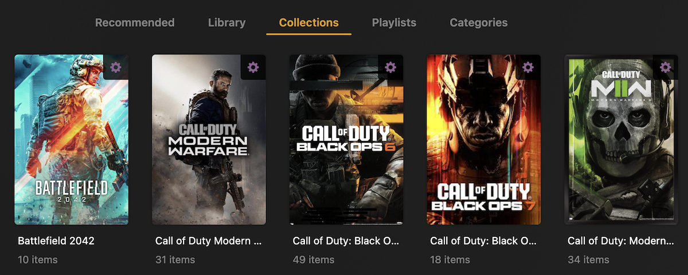

<h1>
  
  ReplayTagger
</h1>

Watches your game clips folder and tags each file with its game name so Plex builds per-game collections automatically. Built for NVIDIA Instant Replay, works with any capture tool that organizes clips into per-game folders.

[](https://github.com/iamclements/replay-tagger/actions/workflows/ci.yml)
[](https://github.com/iamclements/replay-tagger/actions/workflows/security.yml)
[](LICENSE)
[](https://github.com/iamclements/replay-tagger/pkgs/container/replay-tagger)



---

## The idea

NVIDIA saves clips into folders named after the game you were playing, whether triggered by a hotkey or recorded as a full session. ReplayTagger watches those folders and writes the game name into each clip's genre metadata using ffmpeg. Plex reads that tag and automatically places each clip into the right game collection.

Other capture software that organizes clips into per-game subfolders works the same way; the folder name is all ReplayTagger needs.

**Your video files are not re-encoded.** ffmpeg remuxes to a temp file in the same directory, atomically replaces the original, and restores the original modification timestamp. The file is identical except for the genre tag.

YouTube archiving is an optional bonus. Clips are uploaded as-is; YouTube re-encodes everything through their own pipeline regardless, so there's no benefit to pre-encoding locally. Each file is fingerprinted so it's never uploaded twice even if you rename it.

---

## What you need

- **A gaming PC** with [NVIDIA GeForce Experience](https://www.nvidia.com/en-us/geforce/geforce-experience/) or any capture tool that saves clips into per-game subfolders
- **A homelab server or NAS** running Docker (this is where ReplayTagger and Plex live: Synology, Unraid, TrueNAS SCALE, Raspberry Pi, or any Linux machine)
- **Plex Media Server** already running on that server
- **A way to get clips to your server**: [Syncthing](https://syncthing.net/) is the easiest option (see [Step 2](#step-2-get-your-clips-to-the-server))

> **ReplayTagger runs on your server, not your gaming PC.** It only needs network access to Plex and to the folder where clips land; it doesn't have to run on the same host as Plex.

Optional: a Google account for YouTube archiving.

---

## How it works

Your capture software organizes clips into per-game folders (NVIDIA GeForce Experience does this automatically):

```
Videos/
├── Apex Legends/
│   ├── clip1.mp4   ← tagged "Apex Legends"
│   └── clip2.mp4
└── Cyberpunk 2077/
    └── clip1.mp4   ← tagged "Cyberpunk 2077"
```


1. A clip is saved to a per-game folder on your gaming PC
2. A sync tool (e.g. Syncthing) delivers it to your server
3. ReplayTagger detects the new file and writes the game name into the genre tag
4. Plex reads the tag and adds the clip to the matching game collection
5. Optionally: a webhook notification fires and a YouTube upload is queued

---

## Setup

### Step 0: Get docker-compose.yml

Download [docker-compose.yml](docker-compose.yml) to the machine that will run the container. The image is pulled automatically on first start; nothing else needs to be installed.

```bash
curl -O https://raw.githubusercontent.com/iamclements/replay-tagger/main/docker-compose.yml
```

NAS and GUI users (Synology, Unraid, Portainer): download the file and skip to [NAS / Container Management UIs](#nas--container-management-uis).

---

### Step 1: Create a Plex library

1. Plex Web → **Libraries** → **Add Library**
2. Type: **Movies** (Home Videos doesn't support genre-based collections)
3. Name it (e.g. `Gaming Clips`) and note the exact name
4. Point it at the folder where clips will land
5. **Advanced** tab → **"Automatically create collections"** → **"by Genre"**

Note the library name; it goes into `config.yaml` in Step 3.

> **Tip:** if Plex is matching your clips against its movie database and overwriting the genre tag, go to the library's **Advanced** settings and switch the agent to **Personal Media**. ReplayTagger writes genre tags directly into the file (no online matching needed).

> **If the library name in config.yaml doesn't match exactly, ReplayTagger will start but Plex scans and collection creation will silently do nothing.** Check the logs if clips aren't appearing.

---

### Step 2: Get your clips to the server

**Where NVIDIA saves clips**

By default, NVIDIA GeForce Experience saves to:
```
C:\Users\<your-username>\Videos\
```
Each game gets its own subfolder automatically.

**Syncing to your server**

[Syncthing](https://syncthing.net/) is the recommended option: free, open source, and runs on Windows, Linux, and most NAS platforms. See the [Getting Started guide](https://docs.syncthing.net/intro/getting-started.html) for setup.

Alternatives:
- **Network share (SMB):** Map your server's clips folder as a network drive on your gaming PC, then change the NVIDIA save path in GeForce Experience → **Settings** → **General** → video save location. No sync tool needed.
- **Same machine:** If you run Docker on your gaming PC, point `CLIPS_DIR` at your NVIDIA clips folder directly

---

### Step 3: Configure

Download [config.yaml.example](config.yaml.example) as `config.yaml` and [.env.example](.env.example) as `.env`, both next to your `docker-compose.yml`:

```bash
curl -O https://raw.githubusercontent.com/iamclements/replay-tagger/main/config.yaml.example
mv config.yaml.example config.yaml

curl -O https://raw.githubusercontent.com/iamclements/replay-tagger/main/.env.example
mv .env.example .env
```

**`.env`**: set your clips path and Plex URL:

```bash
CLIPS_DIR=/clips               # always /clips when using the default compose file
PLEX_URL=http://192.168.1.100:32400
```

> `CLIPS_DIR` is the path *inside the container*, always `/clips` with the default compose file. Common host-side paths: Synology `/volume1/clips`, Unraid `/mnt/user/clips`, bare Linux `/mnt/clips`. Only the left side of the volume mount changes; the right side stays `/clips`.

**`config.yaml`**: enable Plex and set the library name:

```yaml
plex:
  enabled: true
  library_name: "Gaming Clips"   # must match exactly what you created in Step 1
  auto_scan: true
  auto_create_collections: true
```

> `data_dir` defaults to `data/`, which maps to `/app/data` in the container; leave it as-is. It holds the SQLite state database, Plex token, and YouTube token.

See [config.yaml.example](config.yaml.example) for all options with inline documentation.

---

### Step 4: Get your Plex token

In Plex Web, browse to any item in your library, click **(...)** → **Get Info** → **View XML**, and copy the value of `X-Plex-Token` from the URL bar. Paste it into `.env`:

```bash
PLEX_TOKEN=xxxxxxxxxxxxxxxxxxxx
```

Plex tokens don't expire and grant full access to your account; treat this value like a password and never commit it to git.

> **Alternative:** run `replaytagger plex-auth` for a guided browser-based flow that saves the token to `data/plex_token` automatically. See the [CLI Reference](#cli-reference) for details.

---

### Step 5: Set up volumes and start

Copy [docker-compose.yml](docker-compose.yml) from the repo to your server. Edit the **left side** of each volume mount and set `PUID`/`PGID` to match the owner of your clips folder (run `id` on the host to find the right values).

> `CLIPS_DIR` is always `/clips` inside the container; only the host-side path (left of the colon) changes.

```bash
docker compose up -d
docker compose logs -f
```

ReplayTagger scans all existing clips first, tags any that haven't been tagged yet, then switches to watching for new files.

**Verify your setup:**

```bash
docker compose run --rm replaytagger replaytagger --config /app/config.yaml doctor
```

All checks green means clips will be tagged and Plex collections will update automatically.

---

### Step 6 (Optional): Set up YouTube archiving

Free permanent archival storage. ReplayTagger uploads the source file without pre-encoding; YouTube re-encodes all uploads through their own pipeline regardless, so the stored copy reflects their transcoding, same as any other YouTube upload.

#### Google Cloud setup

1. [console.cloud.google.com](https://console.cloud.google.com/) → new project
2. **APIs & Services → Library** → enable **YouTube Data API v3**
3. **APIs & Services → Credentials → Create Credentials → OAuth client ID**
   - If prompted to configure a consent screen: External → app name + email → save
4. Application type: **TV and Limited Input devices** (required for headless device flow)
5. Add to `.env`:
   ```bash
   YOUTUBE_CLIENT_ID=your_client_id
   YOUTUBE_CLIENT_SECRET=your_client_secret
   ```

#### Authorize

```bash
# The first "replaytagger" is the Docker service name; the second is the CLI command
docker compose run --rm replaytagger replaytagger --config /app/config.yaml youtube-auth
```

Enter the displayed code at `google.com/device`. Token saved to `data/youtube_token.json` (one-time setup).

#### Enable in config.yaml

```yaml
youtube:
  enabled: true
  auto_upload: false        # set true to upload automatically as clips arrive
  privacy: private          # private | unlisted | public
  upload_after_days: 0      # wait N days before auto-uploading (0 = immediately)
```

> Set `upload_after_days` to a non-zero value if you want a review window before clips go public. `youtube-sync` bypasses this; use it to push a backlog on demand.

#### Upload options

| Goal | Command |
|------|---------|
| Upload a single clip now | `replaytagger upload "path/to/clip.mp4"` |
| Upload all tagged clips in batch | `replaytagger youtube-sync` |
| Auto-upload as clips arrive | Set `auto_upload: true` in config.yaml |

---

## Notifications

ReplayTagger can send webhook notifications to Discord or any generic HTTP endpoint when clips are tagged, uploaded, or when errors occur.

```yaml
notifications:
  webhooks:
    - url: https://discord.com/api/webhooks/SERVER_ID/TOKEN
      type: discord
      events: [clip_tagged, scan_complete, error]
```

**Supported types:** `discord` · `generic`

**Supported events:**

| Event | When it fires |
|-------|--------------|
| `clip_tagged` | A new clip is detected and tagged in watch mode (per clip) |
| `clip_uploaded` | A clip is uploaded to YouTube |
| `scan_complete` | A scan run finishes with at least one newly tagged clip |
| `error` | A clip fails to tag or upload |

> `clip_tagged` and `clip_uploaded` fire once per file; leave them out if you have a large backlog to process and don't want per-clip noise. `scan_complete` and `error` are good defaults for everyone.

Discord webhooks send colour-coded embeds (green for tagged, yellow for uploaded, blue for scan complete, red for error). Generic webhooks POST `{"event": "...", "data": {...}}` JSON. Failed webhook requests log a warning and never interrupt tagging.

See [config.yaml.example](config.yaml.example) for the full reference.

---

## Troubleshooting

**Clips aren't being tagged**
```bash
docker compose logs -f replaytagger
```
Check that the left side of the `/clips` volume in `docker-compose.yml` points to the correct host directory and that it exists. `CLIPS_DIR` is always `/clips` inside the container with the default compose file; only the host-side path changes.

**Plex collections aren't appearing**
Confirm the `library_name` in `config.yaml` matches your Plex library name exactly (case-sensitive). Also verify "Automatically create collections by genre" is enabled in the library's Advanced settings.

**Plex auth fails or token is rejected**
Get a fresh token from Plex Web (View XML method in Step 4) and update `PLEX_TOKEN` in `.env`. Tokens don't expire but are invalidated if you change your Plex password or revoke devices from your Plex account dashboard.

**Plex scans not triggering / collections not updating**
ReplayTagger still tags files and updates the database if Plex is unreachable; it logs a warning and continues. Check that `PLEX_URL` resolves from inside the container's network (use the LAN IP, not a hostname that only resolves on the host).

**Check how many clips have been tagged**
```bash
docker exec replaytagger replaytagger --config /app/config.yaml status
```

**Logs are hard to read**
Set `LOG_FORMAT=json` (default) for structured logs, or switch to `LOG_FORMAT=text` for human-readable output during debugging:
```bash
LOG_FORMAT=text docker compose up
```

---

## Plex Collections


With **"Automatically create collections by genre"** enabled (Step 1), Plex handles everything; a new collection appears the first time a clip is tagged for that game.

To create collections manually instead:

1. Open your Plex library → **Collections** → **Create Smart Collection**
2. Rule: **Genre** → **is** → `Apex Legends`

---

## Configuration reference

### config.yaml

```yaml
clips_dir: /clips                    # set via CLIPS_DIR env var for Docker
extensions: [.mp4, .mkv, .mov]
data_dir: data                       # relative to working dir; /app/data in Docker

plex:
  enabled: true
  url: http://192.168.1.100:32400    # set via PLEX_URL env var
  library_name: "Gaming Clips"
  auto_scan: true
  auto_create_collections: true
  verify_ssl: true                   # set false for self-signed certs; also set PLEX_VERIFY_SSL=false in .env

# optional: remap clip folder names to game names for Plex collections
# NVIDIA Instant Replay produces clean names; most users can omit this
# game_name_map:
#   "Apex Legends Season 20": "Apex Legends"
#   "Call of Duty HQ": "Call of Duty: Warzone"

youtube:
  enabled: false
  auto_upload: false
  privacy: private
  upload_after_days: 0

# optional: webhook notifications (discord | generic)
# notifications:
#   webhooks:
#     - url: https://discord.com/api/webhooks/...
#       type: discord
#       events: [scan_complete, error]
```

### Environment variables

Secrets always go in `.env`, never in `config.yaml`:

| Variable | Description |
|----------|-------------|
| `PUID` | UID to run as; match to the owner of your clips folder (default: `1000`) |
| `PGID` | GID to run as; match to the owner of your clips folder (default: `1000`) |
| `CLIPS_DIR` | Path to the clips folder on your server |
| `PLEX_URL` | Your Plex server URL |
| `PLEX_TOKEN` | Plex token (alternative to running `plex-auth`) |
| `PLEX_VERIFY_SSL` | Set to `false` if Plex uses a self-signed cert (default: `true`) |
| `YOUTUBE_CLIENT_ID` | GCP OAuth client ID |
| `YOUTUBE_CLIENT_SECRET` | GCP OAuth client secret |
| `YOUTUBE_ENABLED` | `true` or `false`; overrides config.yaml |
| `YOUTUBE_PRIVACY` | `private`, `unlisted`, or `public` |
| `YOUTUBE_UPLOAD_AFTER_DAYS` | Override `upload_after_days` |
| `LOG_LEVEL` | `DEBUG`, `INFO`, `WARNING` (default: `INFO`) |
| `LOG_FORMAT` | `json` or `text` (default: `json`) |

---

## CLI Reference

> **Docker users:** most day-to-day operation is handled automatically. The commands below are for one-off tasks or if you're running ReplayTagger outside Docker.

```
replaytagger [--config PATH] [--dry-run] COMMAND

Commands:
  run            Scan all clips once, tag untagged files, then exit
  watch          Watch for new clips and process them as they arrive
  retag FILE     Force-retag a single clip, overriding any existing genre tag
  doctor         Run pre-flight checks: Plex connectivity, ffmpeg, paths, credentials
  plex-auth      Authorize Plex via PIN flow; saves token to data/plex_token
  youtube-auth   Authorize YouTube via device flow (URL + code, no browser needed)
  youtube-sync   Upload all tagged clips that have passed upload_after_days
  upload FILE    Upload a single clip to YouTube
  status         Show tagging and upload counts and last activity
```

```bash
# Preview what would be tagged without changing anything
replaytagger --dry-run run

# Retag everything (e.g. after updating game_name_map)
replaytagger run --force

# Force-retag a single clip with an optional name override
replaytagger retag "clips/Apex Legends/clip1.mp4" --game "Apex Legends"

# Upload a specific clip as unlisted
replaytagger upload "clips/Apex Legends/clip1.mp4" --privacy unlisted

# Check tagging and upload counts
replaytagger status
```

---

## NAS / Container Management UIs

Tools like Synology Container Manager, Unraid, TrueNAS SCALE, and similar UIs can deploy this container without the CLI. Use these mappings:

| Setting | Value |
|---------|-------|
| Image | `ghcr.io/iamclements/replay-tagger:latest` |
| Volume | `/your/clips/folder` → `/clips` |
| Volume | `/your/data/folder` → `/app/data` |
| Volume | `/your/config.yaml` → `/app/config.yaml` (read-only) |
| Env | `PLEX_URL`, `CLIPS_DIR`, and any others from `.env.example` |

To run auth commands, use your UI's console/exec feature or:

```bash
docker exec -it replaytagger replaytagger --config /app/config.yaml plex-auth
```

> **Note:** `plex-auth` launches a PIN-based browser flow and requires a TTY. The View XML method in [Step 4](#step-4-get-your-plex-token) works without a TTY and is the recommended approach for NAS/container UI setups.

Pre-built images for `amd64` and `arm64` are published to GitHub Container Registry on every release. The `arm64` image runs natively on Raspberry Pi and most NAS SoCs.

**Version pinning:** use a release tag instead of `latest` if you want to control updates:
```
ghcr.io/iamclements/replay-tagger:v1.2.3
```
All releases are listed on the [GitHub releases page](https://github.com/iamclements/replay-tagger/releases).

**Healthcheck:** the container exposes a Docker healthcheck that monitors a heartbeat file written by the watcher every cycle. Container management UIs (Portainer, Synology, Unraid) will show the container as `healthy` or `unhealthy` automatically (no extra configuration needed).

---

## Development

```bash
git clone https://github.com/iamclements/replay-tagger
cd replay-tagger
make install       # creates .venv and installs package + dev deps
source .venv/bin/activate
make test          # pytest
make lint          # ruff + mypy
make docker-build  # build image locally
```

See the [Makefile](Makefile) for all available targets.

### Project Structure

```
replaytagger/
├── cli.py            # Click CLI entry point
├── config.py         # YAML + env var config loading
├── db.py             # SQLite state tracking
├── tagger.py         # ffmpeg/ffprobe genre tagging
├── plex_client.py    # Plex API integration
├── youtube_client.py # YouTube Data API v3 upload
├── watcher.py        # Watchdog file system monitor
└── logging.py        # structlog configuration
```

---

## Contributing

Contributions are welcome. Please see [CONTRIBUTING.md](CONTRIBUTING.md) for guidelines.

Use the provided issue templates for [bug reports](.github/ISSUE_TEMPLATE/bug_report.md) and [feature requests](.github/ISSUE_TEMPLATE/feature_request.md).

See [SECURITY.md](SECURITY.md) for the vulnerability disclosure policy and the list of sensitive files this project handles.

---

## License

MIT. See [LICENSE](LICENSE).
